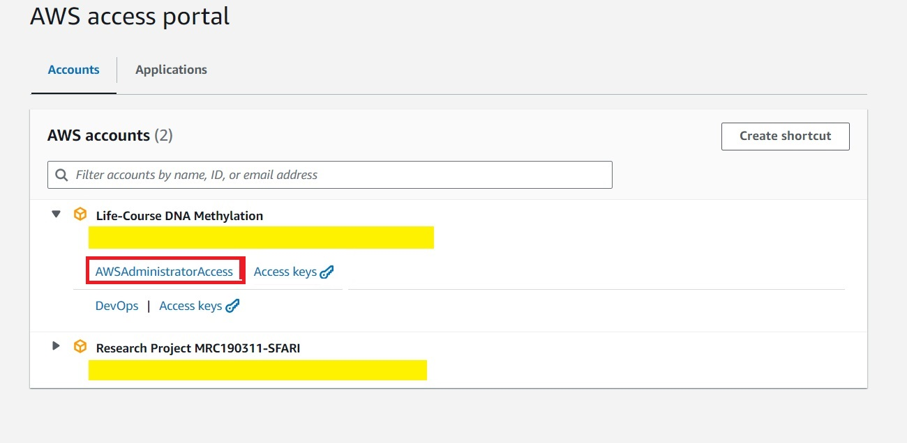

# Verifying Deployment

## via EB-CLI
The status of the Elastic Beanstalk environment can be checked on the windows terminal:
```markdown
> eb list
Environment details for: isoVis-env
  Application name: isoVisDev
  Region: eu-north-1
  Deployed Version: app-1fe2-240926_180444424798
  Environment ID: e-dqvv825srf
  Platform: arn:aws:elasticbeanstalk:eu-north-1::platform/Python 3.11 running on 64bit Amazon Linux 2023/4.0.11
  Tier: WebServer-Standard-1.0
  CNAME: isoVis-deploy-env.eba-r7r9zsja.eu-north-1.elasticbeanstalk.com
  Updated: 2024-09-26 17:23:17.866000+00:00
  Status: Ready
  Health: Grey
Alert: The platform version that your environment is using isn't recommended. There's a recommended version in the same platform branch.

```

The list of environments can be checked with:
```markdown
> eb list
* isoVis-env  # showing that we are using this environment
isoVis2-env
```
To switch environments:
```markdown
> eb use isoVis2-env
> eb list
isoVis-env  
* isoVis2-env
```

To open the application on the platform:
```markdown
> eb open
```

## via AWS web
1. Log into AWS, and click on <span class="button">Access</span> rather than <span class="button">Access keys</span>. 


2. Search for <span class="search">Elastic Beanstalk</span> on the opened AWS web. 


3. This will open up the applications and environments initiated. Hopefully, the application and environment created is listed. 


4. Click on the application, and the domain to open the application. 


