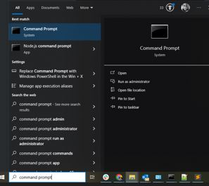

## Installation
1. Install pre-requisite packages:
   - Download [python](https://www.python.org/downloads/) for Windows. 
   > **Important:** Ensure to check "add to path" on pop-up window
   - Download [git](https://git-scm.com/download/win) for Windows. 

2. Type command prompt on Windows search.
<br>
<br>


This will open a new Windows terminal. 

3. In the terminal, install eb command line interface. On the command prompt, type:
    ```shell
    pip install virtualenv
    git clone https://github.com/aws/aws-elastic-beanstalk-cli-setup.git
    python .\aws-elastic-beanstalk-cli-setup\scripts\ebcli_installer.py
    eb
    ```

4. Install aws. 
    ```shell
    pip install awscli
    aws --version
    ```